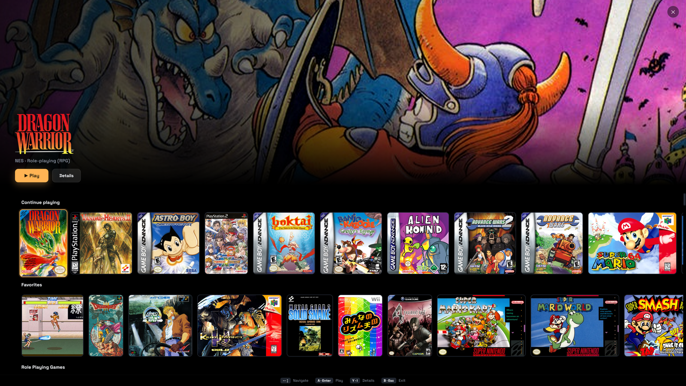
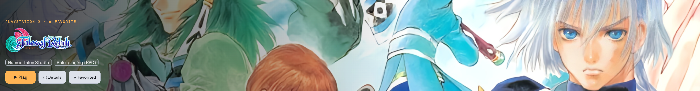
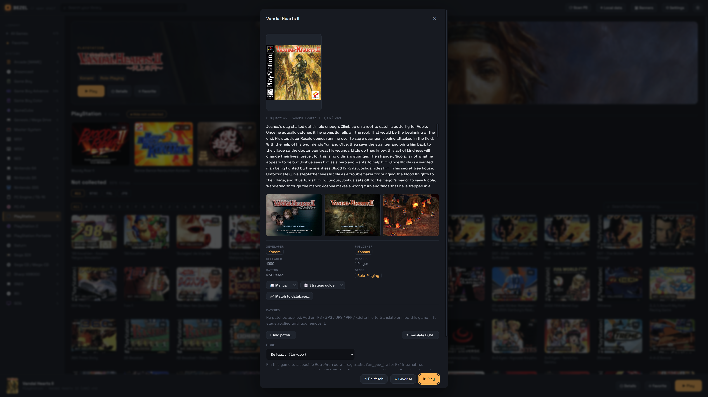
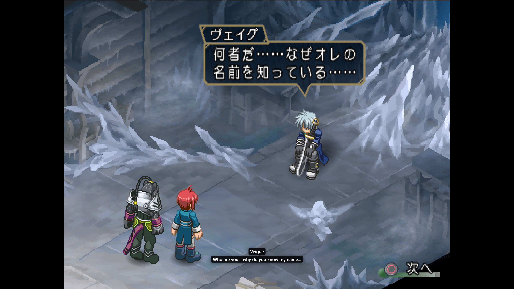

  

<h1 align="center">Bezel</h1>
<h3 align="center">Your whole retro library, beautifully shelved.</h3>

  
  
  
  

  <a href="https://github.com/BezelMedia/Bezel/releases/latest"><b>⬇ Download</b></a> ·
  <a href="https://retrobezel.com">Website</a> ·
  <a href="https://ko-fi.com/retrobezel">Support</a> ·
  <a href="https://github.com/BezelMedia/Bezel/issues">Feedback</a>

  Bezel turns a pile of scattered ROMs and discs into a gorgeous, console-style shelf —
  box art, descriptions, cloud-synced saves, and live on-screen translation, with every
  system you love in one place. Built for the couch and the controller.

> [!WARNING]
> **Alpha software** — expect rough edges and changes between builds. Bezel is a **launcher**: it ships **no games and no BIOS**. You bring your own files and own the rights to use them.

---

## Showcase

   
  <em>Your library, as a shelf — owned games up top, the full catalog below.</em>

   
  <em>TV / couch mode — one button turns Bezel into a console-style big-picture view.</em>

   
  <em>Big, cinematic hero banners — fetched free from SteamGridDB.</em>

  
   
  <em>Rich game details &nbsp;·&nbsp; live on-screen translation for import games.</em>

---

## Download & install

1. Grab the latest **`Setup.exe`** from [**Releases**](https://github.com/BezelMedia/Bezel/releases/latest).
2. Run it. Windows SmartScreen may warn that the app is unrecognized (it isn't code-signed yet) — click **More info → Run anyway**.
3. On first launch Bezel creates its folders under **`Documents\Bezel`** and quietly downloads RetroArch from libretro in the background. Drop your games into the matching per-system folder under `Documents\Bezel\roms`, then hit **Scan**.

> Already installed? Update in-app from **Settings → Software update** — no need to reinstall.

---

## Features

### 🗂️ A library that looks like a console, not a file manager
- **Visuals-first shelf** — box art, wide hero banners, and clear logos, browsable with mouse, keyboard, or controller.
- **Built-in offline database** — Bezel identifies each ROM **by hash** (No-Intro / Redump), gives it its real name, and pulls box art, title screens, and screenshots automatically. No scraping, no API key, no account.
- **Browse "not-collected"** — see *every* game for a system, with art, even the ones you don't own yet — a built-in wishlist and discovery tool.
- **Facts & descriptions** — genre, developer, publisher, year, player count, and a summary for thousands of titles, all offline.
- **Optional online polish** — add a free [SteamGridDB](https://www.steamgriddb.com) key for big hero banners + logos, or TheGamesDB for the rare title the built-in database misses.

### 📺 TV / couch mode
- **One-button big-picture** — go full-screen into a console-style view: a cinematic hero for the game in focus over horizontal shelves of cover art.
- **The rows that matter** — *Continue playing*, *Most played*, your collections, and every system, all browsable from the sofa.
- **Controller-first** — D-pad/stick to glide the cover cursor, **A** to play, **Y** for details, **B** to drop back to the desktop view.

### 🗃️ Collections, your way
- **Custom collections** — group games into named lists (Backlog, RPG night, co-op favourites) and add any game from its details page.
- **Auto cover-mosaic art** — each collection illustrates itself from its games' covers, Apple/Nintendo-playlist style, or pick from a gallery of icons and colours.
- **Smart collections** — *Recently played*, *Unplayed*, and *Recently added* build themselves, no tagging required.

### 🖼️ Beautiful hero banners
- **Wide, cinematic hero art and crisp logos** for the game you're looking at — your shelf goes from a grid of boxes to a cover-flow-worthy showcase.
- **Free to switch on:** create a [**SteamGridDB**](https://www.steamgriddb.com) account, generate an API key (takes a minute), paste it into **Settings → SteamGridDB key**, and hit **Fetch banners**. Bezel finds a matching hero banner + logo for each title automatically.
- **Yours to curate** — don't like a match? Swap or remove a banner per game and Bezel remembers your choice.

### 🎮 Play any way you like
- **RetroArch by default** — downloaded automatically from libretro on first run, with cores fetched on demand per system. Per-game core overrides, bezels, and patches; multi-disc games just work.
- **In-app play** — opt any 2D / lighter system into Bezel's built-in WASM cores for instant, no-setup play. Those cores are pre-downloaded on first run, so in-app play works offline too.
- **Pick your video driver** — OpenGL, Vulkan, or Direct3D 11, or an **Auto** mode that chooses the best one per system.
- **Custom emulators** — point any system at your own emulator (e.g. Azahar for 3DS `.cia`) with a `{rom}` argument template.
- **Save states & resume**, **in-app screenshots & recording**, **start-in-fullscreen**, and a controller-friendly in-game menu.

### 🏆 RetroAchievements
- **Earn achievements** in RetroArch-launched games, with on-screen unlock pops and an optional **hardcore mode**.
- **Built-in dashboard** — your profile, points, recent unlocks, and per-game progress, plus each game's full achievement list right in its details.
- Sign in with your free [RetroAchievements](https://retroachievements.org) account — your password is never stored, only a login token.

### 💿 Real discs, first-class
- **Identify** a disc the moment you insert it.
- **Install / rip** optical discs to clean `.chd` (or CUE+BIN) so they patch and play.
- **Play straight off the drive** — no rip needed for PS1, Saturn, Sega CD, and 3DO.

### ☁️ Saves that follow you
- Point Bezel at a folder your **Google Drive / Dropbox / OneDrive / NAS** keeps synced, and your in-app **and** RetroArch saves sync across every device that uses the same folder.

### 🌐 Read import games
- **Live on-screen translation** while you play — a **Vision model** reads and translates the whole screen (great for stylized fonts), or **OCR → DeepL** for speed. One-shot, an **Auto** mode that re-translates as the text changes, a **region selector** to box just the dialogue, and a per-game **glossary** so names stay consistent.

### 🎨 Make it yours
- **Custom bezels** — auto-generated from a game's box art, or supply your own artwork with a per-game screen cutout.
- **Light / dark theme**, and **controller-first** navigation throughout (with an in-game Up+Start menu and remapping).

### 🔧 Tinkerer-friendly
- **Patches & fan-translations** — apply IPS / BPS / UPS / xdelta / PPF, with an optional patch-library folder.
- **Manuals & strategy guides** — drop in your own PDF / CBZ / CBR scans and read them in an in-app, controller-navigable viewer.
- **GOG library** — point at your GOG install folder to shelve and launch those games too.

### 🔒 Offline, private, free
- The database is **built in** — Bezel works without an internet connection (except optional one-time downloads). **No account, no telemetry, no store.**

---

## Supported systems

Nintendo — **NES · SNES · N64 · Game Boy · GBC · GBA · DS · 3DS · GameCube · Wii**
Sega — **Master System · Genesis/Mega Drive · 32X · Sega CD · Saturn · Dreamcast**
Sony — **PlayStation · PS2 · PSP**
NEC — **PC Engine / TurboGrafx-16 · PC-FX**
Other — **Neo Geo CD · 3DO · MSX · MSX2 · Sharp X68000 · Arcade (MAME) · GOG**

---

## Quick start

1. **Settings → ROM library folder** is pre-set to `Documents\Bezel\roms` (change it if you keep games elsewhere).
2. Drop your ROMs into the matching subfolder (`…\roms\snes`, `…\roms\psx`, …).
3. Hit **Scan** — Bezel identifies each game and fills in art + info automatically.
4. For BIOS-dependent systems (PS1, Sega CD, Saturn, etc.), set a **BIOS folder** in Settings and drop your BIOS files there.
5. Press **Play** (or **A** on a controller). That's it.

---

## FAQ

**Does Bezel include games or BIOS?**
No. It's a launcher for files you already own — it ships neither.

**Do I need RetroArch installed?**
No. Bezel downloads it for you on first run. If you already have RetroArch, you can point Bezel at it in Settings.

**Why the SmartScreen warning?**
The installer isn't code-signed yet (it's an Alpha). Click **More info → Run anyway**. Signing is planned.

**Where do my games and saves live?**
Under `Documents\Bezel` by default — all paths are changeable in Settings. Cloud saves go to whatever synced folder you choose.

---

## Not affiliated

Bezel is an independent project and is **not affiliated with or endorsed by** Nintendo, Sega, Sony, SNK, NEC, or any other rights holder. All trademarks belong to their respective owners.

## Feedback

Hit a bug or have an idea? [**Open an issue**](https://github.com/BezelMedia/Bezel/issues) — Alpha feedback is hugely appreciated. ❤️
